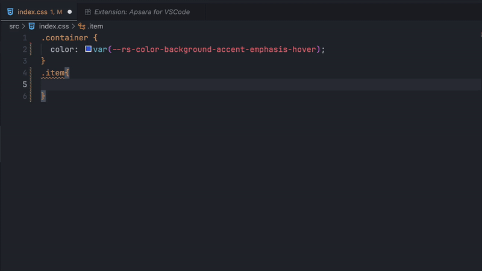
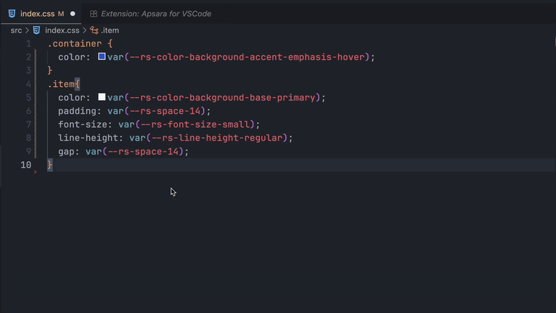
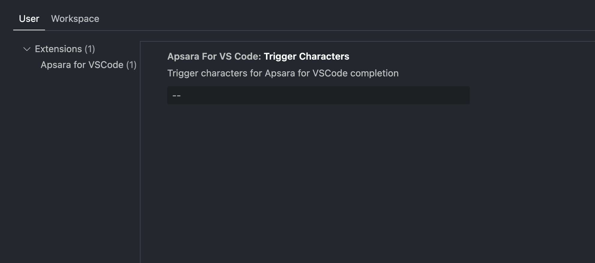

# Apsara for VS Code

A powerful VS Code extension that provides intelligent autocomplete and hover previews for Apsara Design Tokens, making your design system development faster and more accurate.

## Features

### 🚀 Autocomplete

Get context-aware suggestions for Apsara Design Tokens. The extension analyzes your current CSS context and provides relevant token suggestions.

- **Property-aware suggestions**: Type `color: ` and get color tokens, type `padding: ` and get spacing tokens
- **Smart filtering**: Tokens are filtered based on their semantic meaning and usage context
- **Quick insertion**: Tokens are automatically wrapped in `var()` function for proper CSS custom property usage



### 👁️ Hover Preview

Instantly see the exact values of Apsara Design Tokens with rich visual previews.

- **Exact values**: See the computed value of each design token
- **Color previews**: Visual color swatches for color tokens




## Usage

### Getting Started

1. Install and enable the extension
2. Open any CSS, SCSS, or Sass file
3. Start typing a CSS property (e.g., `color: `, `padding: `, `font-size: `)
4. Type the trigger character `--` to activate autocomplete
5. Browse through the intelligent suggestions
6. Select a token to insert it with proper `var()` syntax

### Supported File Types

- CSS (`.css`)
- SCSS (`.scss`)

## Configuration

The extension works out of the box with default settings. For advanced configuration, you can modify your VS Code settings:


  
**`triggerCharacters`** (string, default: `"--"`)  
```json
{
  "apsaraForVSCode.triggerCharacters": "--"
}
```

The trigger characters that activate autocomplete for Apsara Design Tokens. You can customize this to use different trigger if needed.

## Support

- 📖 [Documentation](https://apsara.raystack.org)
- 🐛 [Report Issues](https://github.com/raystack/apsara/issues)